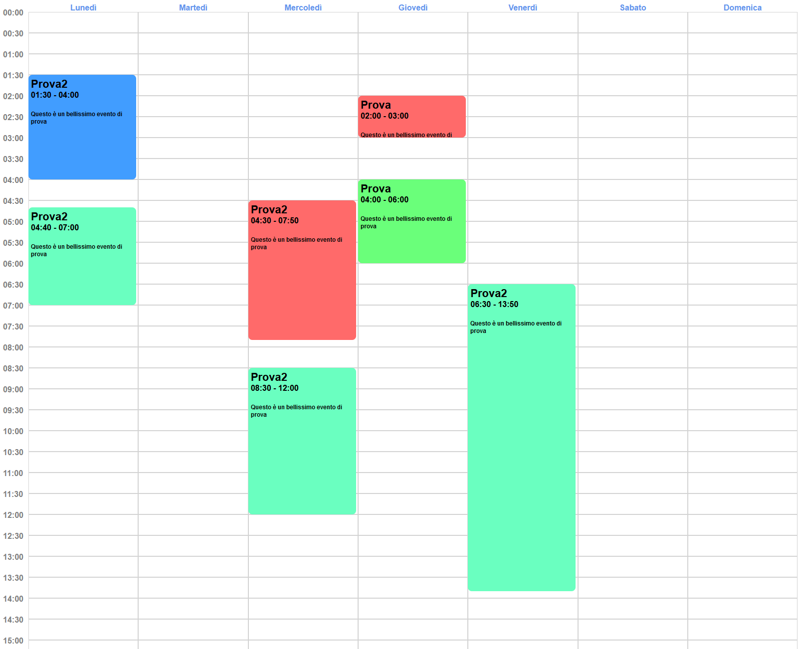

# Javascript basic calendar

Simple implementation of a graphic calendar, created with Stencil Js



<br>
<br>
<br>

## Vanilla Js

### Installation

    npm i javascript-basic-calendar


### Use

###### Html:
```html
<body>
    <my-calendar></my-calendar>
</body>
```


###### index.ts
```typescript

//config:
import { defineCustomElements } from './node_modules/javascript-basic-calendar/loader/index.js'
defineCustomElements();


//get reference:
const myCalendarReference = document.querySelector('my-calendar');


```


### Passing tasks


```typescript
import { MyTaskModel } from './node_modules/javascript-basic-calendar/dist/types/utils/models/myTaskModel.js';

const tasks: MyTaskModel[] = [
    {
        colorCode: '#6AFFC0',
        description: 'Questo è un bellissimo evento di prova',
        id: 'dlfkslfs09s8fsoidks9f0s',
        name: 'Prova',
        startDate: new Date(2022, 2, 24, 2, 0),
        endDate: new Date(2022, 2, 24, 3, 0)
    },
    {
        colorCode: '#6AFFC0',
        description: 'Questo è un bellissimo evento di prova',
        id: 'dlfkslfs09s8fsoidks9f0s',
        name: 'Prova2',
        startDate: new Date(2022, 2, 23, 4, 30),
        endDate: new Date(2022, 2, 23, 7, 50)
    },
    
]

myCalendarReference.inputTasks = tasks

```


### Handling Events
Events Availables: 
- requestEditTask => Fired when user click on the task
- requestAddTask => Fired when user click on an empty slot
- requestChangeDates => Fired when user click on the topbar (days bar)

```Typescript

myCalendarReference.addEventListener('requestEditTask', (ev) => console.log(ev.detail)) //ev.detail => clicked task id, as you passed in the array (dlfkslfs09s8fsoidks9f0s)
myCalendarReference.addEventListener('requestAddTask', (ev) => console.log(ev.detail)) //ev.detail => clicked slot date and time
myCalendarReference.addEventListener('requestChangeDates', (ev) => console.log(ev.detail)) //ev.detail => void

```


<br>
<br>
<br>
<br>

## Angular


###### Not tested yet