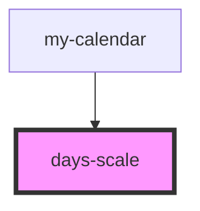

# days-scale

<!-- Auto Generated Below -->

## Events

| Event                | Description | Type                |
| -------------------- | ----------- | ------------------- |
| `requestChangeDates` |             | `CustomEvent<void>` |

## Dependencies

### Used by

 - [my-calendar](../my-calendar)

### Graph

----------------------------------------------

*Built with [StencilJS](https://stenciljs.com/)*
