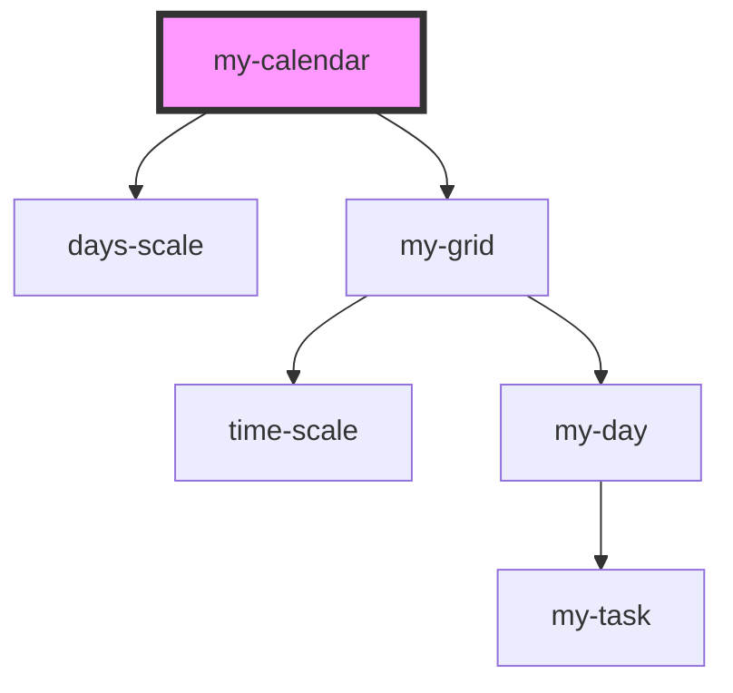

# my-calendar

<!-- Auto Generated Below -->

## Properties

| Property     | Attribute | Description | Type            | Default |
| ------------ | --------- | ----------- | --------------- | ------- |
| `inputTasks` | --        |             | `MyTaskModel[]` | `[]`    |

## Dependencies

### Depends on

- [days-scale](../days-scale)
- [my-grid](../my-grid)

### Graph

----------------------------------------------

*Built with [StencilJS](https://stenciljs.com/)*
