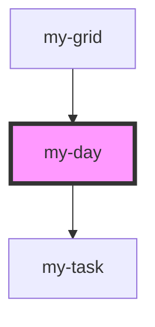

# my-day

<!-- Auto Generated Below -->

## Properties

| Property      | Attribute | Description | Type            | Default     |
| ------------- | --------- | ----------- | --------------- | ----------- |
| `currentDate` | --        |             | `Date`          | `undefined` |
| `listTasks`   | --        |             | `MyTaskModel[]` | `[]`        |

## Events

| Event             | Description | Type                  |
| ----------------- | ----------- | --------------------- |
| `requestAddTask`  |             | `CustomEvent<Date>`   |
| `requestEditTask` |             | `CustomEvent<string>` |

## Dependencies

### Used by

 - [my-grid](../my-grid)

### Depends on

- [my-task](../my-task)

### Graph

----------------------------------------------

*Built with [StencilJS](https://stenciljs.com/)*
