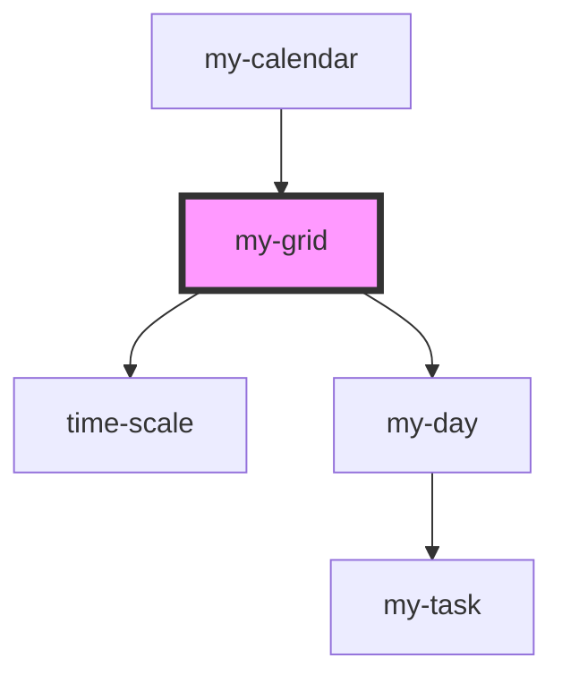

# my-grid

<!-- Auto Generated Below -->

## Properties

| Property    | Attribute | Description | Type            | Default      |
| ----------- | --------- | ----------- | --------------- | ------------ |
| `listTasks` | --        |             | `MyTaskModel[]` | `[]`         |
| `startDate` | --        |             | `Date`          | `new Date()` |

## Dependencies

### Used by

 - [my-calendar](../my-calendar)

### Depends on

- [time-scale](../time-scale)
- [my-day](../my-day)

### Graph

----------------------------------------------

*Built with [StencilJS](https://stenciljs.com/)*
