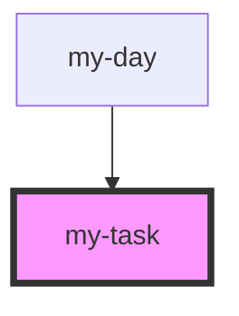

# my-task

<!-- Auto Generated Below -->

## Properties

| Property    | Attribute | Description | Type          | Default     |
| ----------- | --------- | ----------- | ------------- | ----------- |
| `inputTask` | --        |             | `MyTaskModel` | `undefined` |
| `top`       | `top`     |             | `number`      | `undefined` |

## Events

| Event          | Description | Type                  |
| -------------- | ----------- | --------------------- |
| `clickedBody`  |             | `CustomEvent<string>` |
| `clickedTitle` |             | `CustomEvent<string>` |

## Dependencies

### Used by

 - [my-day](../my-day)

### Graph

----------------------------------------------

*Built with [StencilJS](https://stenciljs.com/)*
